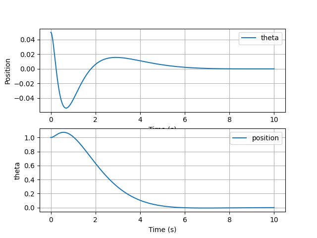

# LQR Inverted Pendulum Simulation

This project simulates a linearized inverted pendulum on a cart controlled by an LQR controller.

## Description

The system consists of a pole attached to a cart. The goal is to balance the pole upright by moving the cart. The control logic is implemented using a Linear Quadratic Regulator (LQR).

## Results

### State Trajectories


### Simulation Video


## How to Run

1.  Ensure you have Python installed.
2.  Install dependencies:
    ```bash
    pip install numpy matplotlib control scipy
    ```
3.  Run the script:
    ```bash
    python lqr_cartpole.py
    ```
