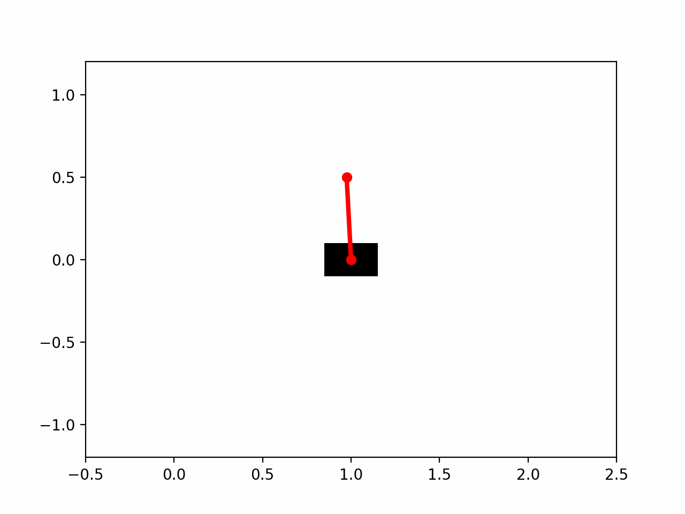
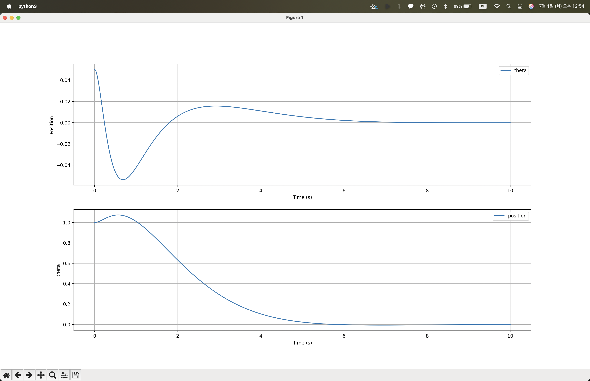
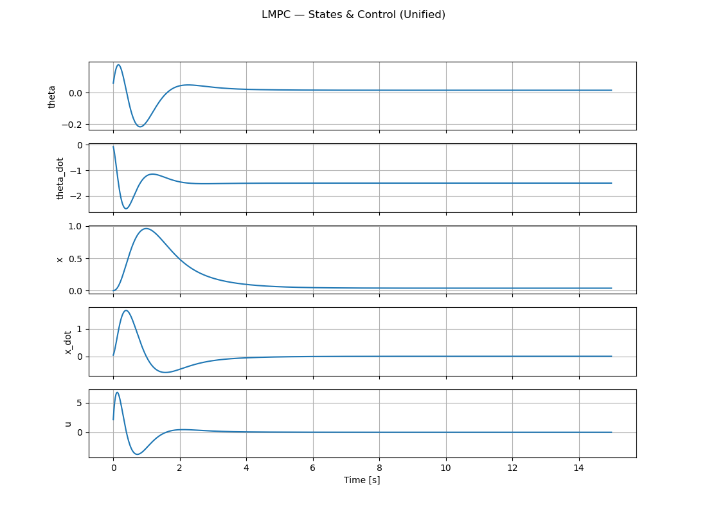

# Inverted Pendulum Optimal Control

This repository contains implementations of optimal control algorithms for the Inverted Pendulum (Cartpole) system. The project explores Linear Quadratic Regulator (LQR), Linear Model Predictive Control (MPC), and Nonlinear MPC.

## 1. LQR (Linear Quadratic Regulator)

The LQR controller is designed to stabilize the inverted pendulum around the upright equilibrium point.

### Simulation Result

### State Trajectories

## 2. Linear MPC

Linear MPC is implemented using a linearized model of the system dynamics.

### Simulation

### State Trajectories

## 3. Nonlinear MPC

Nonlinear MPC uses the full nonlinear dynamics of the cartpole system for optimization.

### Simulation

### State Trajectories

## Directory Structure

- `LQR/`: Contains LQR implementation and results.
- `MPC_Linear/`: Contains Linear MPC implementation and results.
- `MPC_Nonlinear/`: Contains Nonlinear MPC implementation and results.
